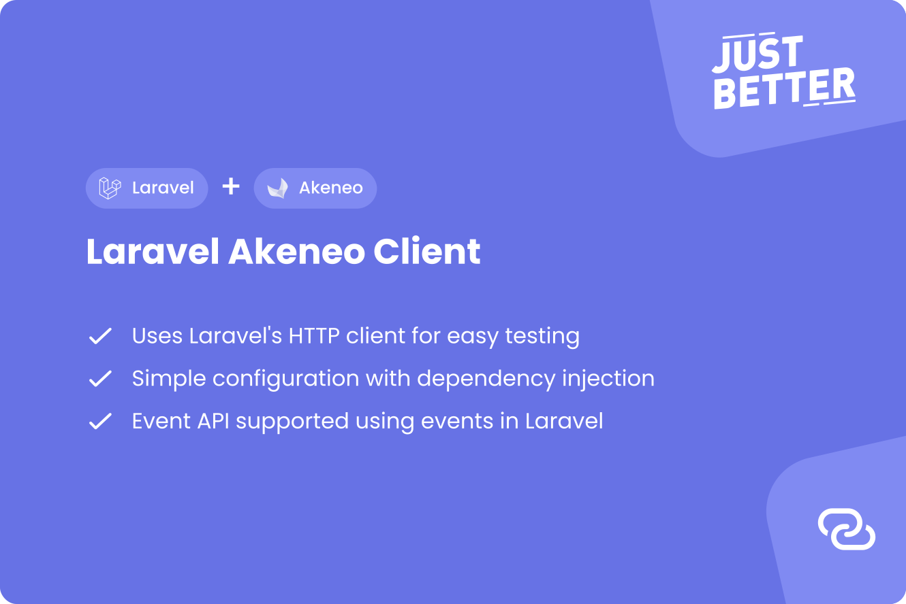

<a href="https://github.com/justbetter/laravel-akeneo-client" title="JustBetter">
    
</a>

# Laravel Akeneo Client

<p>
    <a href="https://github.com/justbetter/laravel-akeneo-client"></a>
    <a href="https://github.com/justbetter/laravel-akeneo-client"></a>
    <a href="https://github.com/justbetter/laravel-akeneo-client"></a>
    <a href="https://github.com/justbetter/laravel-akeneo-client"></a>
</p>

Connect to your Akeneo instance using the official [akeneo/api-php-client](https://github.com/akeneo/api-php-client).
This package will ease configuration, dependency injection and testing for Laravel.

It also has an endpoint available to receive Akeneo events, if enabled.

## Example usage

```php
<?php

use JustBetter\AkeneoClient\Client\Akeneo;

public function __construct(Akeneo $akeneo)
{
    $product = $akeneo->getProductApi()->get('1000');
}
```

## Installation

Install the composer package.

```shell
composer require justbetter/laravel-akeneo-client
```

By default, this package will require the latest version of `akeneo/api-php-client`. You should take a look at the
[compatibility table](https://github.com/akeneo/api-php-client) to see what version you need for your project.

```shell
composer require akeneo/api-php-client "^9.0"
```

## Setup

Optionally, publish the configuration of the package.

```shell
php artisan vendor:publish --provider="JustBetter\AkeneoClient\ServiceProvider" --tag=config
```

## Configuration

Add the following values to your `.env` file.

```
AKENEO_URL=
AKENEO_CLIENT_ID=
AKENEO_SECRET=
AKENEO_USERNAME=
AKENEO_PASSWORD=

AKENEO_EVENT_SECRET=
```

## Events

If you have [enabled](https://help.akeneo.com/pim/serenity/articles/manage-event-subscription.html) the event
subscription in Akeneo you will be to listen to these events.

The event webhook is `/akeneo/event`. This can be configured using the `prefix` in your `akeneo` config file.

[All](https://api.akeneo.com/events-reference/events-reference-serenity/products.html) events are available.

```php
<?php

use Illuminate\Support\Facades\Event;
use JustBetter\AkeneoClient\Events\ProductCreatedEvent;

Event::listen(function (ProductCreatedEvent $event): void {
    //
});
```

## Testing

This package makes testing and mocking Akeneo calls very easily.

```php
<?php

use Illuminate\Support\Facades\Http;
use JustBetter\AkeneoClient\Client\Akeneo;

// This will fake Akeneo credentials and a sign in.
Akeneo::fake();

// Fake the specific call you will be using
Http::fake([
    'akeneo/api/rest/v1/products/1000' => Http::response([
        'identifier' => '1000',
        'enabled' => true,
        'family' => 'hydras',
        'categories' => [],
        'groups' => [],
        'parent' => null,
        'values' => [
            'name' => [
                [
                    'locale' => 'nl_NL',
                    'scope' => 'ecommerce',
                    'data' => 'Ziggy',
                ],
            ],
        ],
    ]),
]);

// Get the product with the fake response
$response = $akeneo->getProductApi()->get('1000');
```

## Quality

To ensure the quality of this package, run the following command:

```shell
composer quality
```

This will execute three tasks:

1. Makes sure all tests are passed
2. Checks for any issues using static code analysis
3. Checks if the code is correctly formatted

## Contributing

Please see [CONTRIBUTING](.github/CONTRIBUTING.md) for details.

## Security Vulnerabilities

Please review [our security policy](../../security/policy) on how to report security vulnerabilities.

## Credits

- [Ramon Rietdijk](https://github.com/ramonrietdijk)
- [All Contributors](../../contributors)

## License

The MIT License (MIT). Please see [License File](LICENSE.md) for more information.

<a href="https://justbetter.nl" title="JustBetter">
    
</a>
